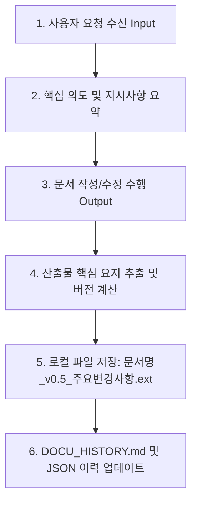

# Docu-Git — 문서 이력관리 에이전트 스킬 (Document Version Control Skill)

**Docu-Git**은 Git의 변경 이력 관리 메커니즘을 문서 작성 작업에 적용한 에이전트 스킬입니다.
사용자의 모든 문서 관련 요청(Input)과 에이전트의 산출물(Output)을 핵심 요지가 손실되지 않도록 고밀도로 요약하여 기록하고, 저장되는 파일명에 버전을 자동으로 부여 관리합니다.

---

## 🎯 주요 특징 (Core Features)

1. **연속적 Input/Output 이력 기록**: 사용자의 대화 요청과 산출물 전체를 원문 훼손 없이 핵심만 축약하여 `DOCU_HISTORY.md`에 지속 기록.
2. **버전 명명 자동화**: 로컬 파일 저장 시 지정된 버전 규칙 자동 적용.
   - **파일명 표준**: `{문서 기본명}_v{버전}_{주요 변경 요약}.{확장자}`
   - **예시**: `행정정책_성과관리논문_v0.5_이론 단일화(젠의 역량접근법).md`
3. **고밀도 요약 (High-Density Summarization)**: 장문의 요청과 산출물에서 노이즈를 제거하고 핵심 논지 및 구조적 변화만 3~5줄로 압축 추출.
4. **Git 라이크 문서 관리 명령어 세트**: Status, Log, Diff, Branch(변형 문서), Tag, Rollback 이력 추적 지원.

---

## 🚀 트리거 조건 (Trigger Keywords)

- **한국어**: `Docu-Git`, `문서 이력관리`, `문서 버전관리`, `문서 이력 기록`, `문서 커밋`, `문서 버전 저장`, `문서 히스토리`, `이력 남겨줘`, `버전 포함 저장`, `문서 버전 확인`
- **English**: `docu-git`, `docugit`, `document version control`, `docu history`, `docu commit`, `docu log`, `docu diff`, `docu status`

---

## 🔄 표준 워크플로우 (Operational Workflow)

Docu-Git 스킬이 활성화되면 문서를 다루는 모든 입출력 프로세스는 다음 5단계를 거칩니다.

### 1단계: Input 수신 및 요약 추출
- 사용자의 요청 문장에서 **작업 의도(Intent)**, **추가/수정/삭제 지시사항**을 포착합니다.
- 부가적인 대화성 수식어를 제외하고 고밀도 아웃라인 형태(3줄 이내)로 핵심만 압축합니다.

### 2단계: 문서 생성 또는 수정 수행
- 요청받은 문서 내용(논문, 보고서, 기획서, 고시문 등)을 완성도 높게 작성합니다.

### 3단계: 문서 버전 (Semantic Version) 계산
- `references/versioning_rules.md` 지침에 따라 버전을 결정합니다:
  - `v0.1`: 최초 구조/개요 수립 및 초안
  - `v0.2~v0.4`: 내용 보완 및 일반적인 수정
  - `v0.5`: 이론적 뼈대 단일화, 주요 섹션 결합 등 주요 업데이트 (Major Milestone)
  - `v1.0`: 최종 완성본 및 확정 제출본

### 4단계: 버전 포함 로컬 파일 저장
- 로컬 파일로 저장 시 파일 명명 규칙을 반드시 준수합니다:
  - `{문서명}_v{버전}_{주요변경사항}.{ext}`
  - 예시: `성과관리논문_v0.5_이론 단일화(젠의 역량접근법).md`

### 5단계: Commit Log 업데이트 (`DOCU_HISTORY.md`)
- `references/commit_log_template.md` 템플릿에 따라 프로젝트의 `DOCU_HISTORY.md`에 새 커밋 블록을 추가합니다.

---

## 🛠️ Docu-Git 전용 관리 기능 (Git-like Commands)

에이전트는 사용자가 다음과 같은 문서 관리 명령을 내릴 때 해당 처리를 수행합니다.

| 명령어 / 요청 | 설명 및 동작 |
| :--- | :--- |
| **`docu-git status`** | 현재 관리 중인 문서 목록, 최신 버전(`vX.Y`), 활성 브랜치 및 최근 커밋 타임스탬프 표시 |
| **`docu-git log`** | 지금까지 기록된 사용자 요청(Input)과 산출물(Output)의 핵심 이력 타임라인 조회 |
| **`docu-git diff <v1> <v2>`** | 두 버전 간의 주요 구조적 변화, 추가/삭제된 핵심 개념 및 논지 차이점 비교 |
| **`docu-git branch <이름>`** | 원본 문서 기반의 변형 버전(예: `요약보고서`, `발표자료용`, `영문판`) 분기 관리 |
| **`docu-git tag <태그명>`** | `final-draft`, `submitted`, `reviewed` 등 이정표 태그 부여 |
| **`docu-git rollback <vX.Y>`** | 이전 버전의 문서 내용과 요약 스냅샷을 확인하고 해당 시점 기준으로 복원 또는 재작성 |

---

## 📁 참조 및 템플릿 문서 (References & Templates)

상세 규칙 및 서식은 다음 하위 참조 파일을 준수합니다:
- **버전 규칙 & 요약 지침**: [`references/versioning_rules.md`](file:///d:/claude/skills/docu-git/references/versioning_rules.md)
- **커밋 로그 템플릿**: [`references/commit_log_template.md`](file:///d:/claude/skills/docu-git/references/commit_log_template.md)
- **이력 매니페스트 JSON**: [`templates/docu_history_manifest.json`](file:///d:/claude/skills/docu-git/templates/docu_history_manifest.json)
